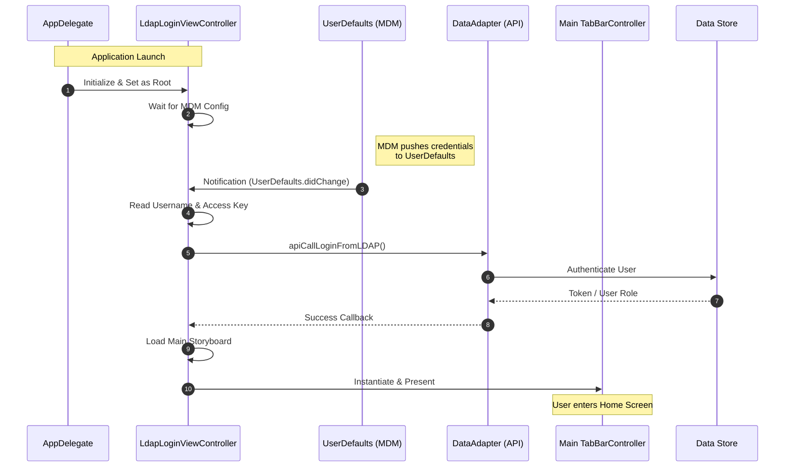

# ASAP iOS Project

**ASAP** (Assist Sales Associate Professional) is an enterprise iOS application developed for City Furniture. It empowers sales associates to manage customer interactions, inventory, and sales transactions efficiently. The application serves as a comprehensive mobile point-of-sale and customer management tool, integrating deeply with internal systems for product catalogs, cart management, and user authentication.

## 📊 Project Diagrams

### High-Level Architecture
The application follows a traditional **MVC (Model-View-Controller)** pattern, heavily relying on Singleton managers for state and data access.

```mermaid
graph TD
    User[User / Sales Associate] --> UI[View Controllers Layer]
    UI --> AppDel[AppDelegate (Global State)]
    UI --> DataAdapter[DataAdapter (Networking & Logic)]
    
    subgraph Data Layer
        DataAdapter --> CoreData[(Core Data / SQLite)]
        DataAdapter --> Network[AKNetworking Framework]
    end
    
    subgraph External Services
        Network --> API[Backend APIs]
        AppDel --> ConfigCat[ConfigCat (Feature Flags)]
        AppDel --> NewRelic[NewRelic (Monitoring)]
    end
    
    classDef primary fill:#f9f,stroke:#333,stroke-width:2px;
    class UI,DataAdapter,CoreData primary;
```

### Authentication Sequence (MDM & LDAP)
This diagram illustrates the initialization flow, highlighting the reliance on MDM (Mobile Device Management) pushed configurations rather than standard user login screens.



## 🚀 Getting Started

Follow these instructions to set up the development environment and run the project.

### Prerequisites
*   **macOS** with latest Xcode installed.
*   **CocoaPods** dependency manager (`sudo gem install cocoapods`).
*   **Bitbucket Access**: SSH keys configured for `cityfurnituredev` repositories (required for internal pods).

### Installation Steps

1.  **Clone the Repository**
    ```bash
    git clone [repository-url]
    cd ASAP
    ```

2.  **Install Dependencies**
    The project relies on CocoaPods for 3rd party and internal libraries.
    ```bash
    cd ASAP
    pod install
    ```
    *Note: Ensure you are on the `ASAP` directory level containing the `Podfile`.*

3.  **Open the Workspace**
    **CRITICAL**: Always open the `.xcworkspace` file, not the project file.
    ```bash
    open ASAP.xcworkspace
    ```

### Running the Application

1.  Select the **ASAP** scheme in Xcode.
2.  Choose a Target Device (Simulator or Physical Device).
3.  Press **Cmd + R** to Build and Run.
4.  *Note: For the login flow to work in Simulator, you may need to manually trigger the UserDefaults change notification or mock the MDM configuration key.*

## ⚙️ Dependencies and Usage

The project utilizes a mix of internal frameworks and public libraries.

| Dependency/Library | Primary Usage in Project |
| :--- | :--- |
| **AKNetworking** | Internal framework handling all HTTP/REST API network requests. |
| **AKLogin** | Internal component managing specific login UI and flows. |
| **AKKeychain** | Secure wrapper for saving credentials/tokens in the iOS Keychain. |
| **Core Data** | Native framework used for local persistence of Products, Customers, and Carts. |
| **NewRelicAgent** | Application performance monitoring (APM) and crash reporting. |
| **ConfigCat** | Remote feature flag management to toggle features dynamically. |
| **CocoaPods** | Dependency manager used to integrate the above libraries. |

## ⚠️ Known Issues and Limitations

Please be aware of the following architectural and performance issues currently present in the codebase:

*   **Main Thread Performance Bottleneck (Fibonacci Calculation)**
    *   **Issue**: The `AppDelegate` contains a `Timer` that runs indefinitely, calculating Fibonacci numbers (`calculateNextNumber`) on the main thread.
    *   **Impact**: Wastes CPU cycles, drains battery, and may cause UI stuttering. This appears to be debug code left in production.

*   **Inefficient Data Deletion Strategy**
    *   **Issue**: The `CoreDataHelper.deleteAllObjects` method iterates physically through every managed object to delete them one-by-one instead of performing a batch delete request.
    *   **Impact**: Operations clearing the database (e.g., logout or reset) can block execution for significant time periods if the dataset is large.

*   **Singleton & Memory Management Risks**
    *   **Issue**: The application relies heavily on "God Class" Singletons (`CoreDataHelper`, `DataAdapter`, `AppDelegate`) that retain state and references throughout the app lifecycle.
    *   **Impact**: Makes unit testing difficult, increases the risk of retain cycles, and makes state management unpredictable across different user sessions.
